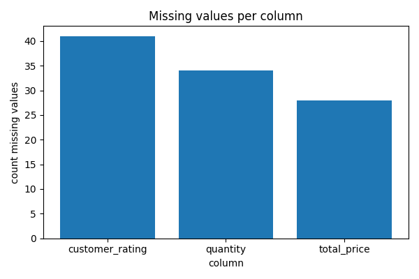
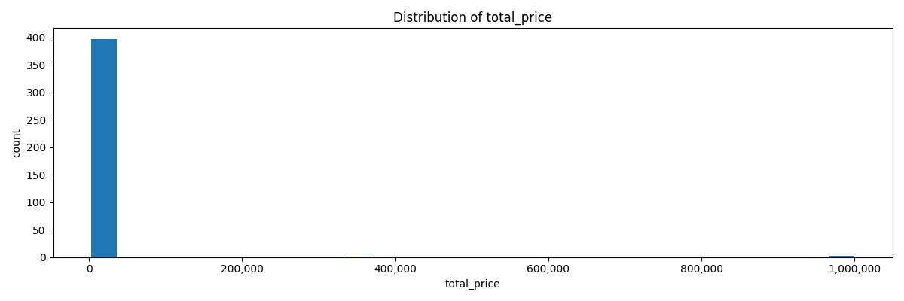
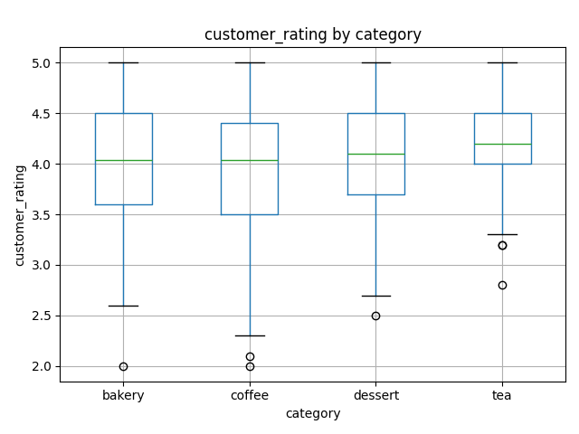

# Lab 1 Report — {20231879} {이정연(LeeJeongyeon)}

## 1. What I did
I followed the provided skeleton and completed the four TODO blocks in `src/lab01.py`. 
For the visualization notebook, I used the completed functions to plot missing values per column, the distribution of `total_price`, and `customer_rating` by category.

## 2. Results

**Table 1. Key numbers from `results.json`.** 
I did not expect to find 12 duplicate rows, and if this were real collected data, I would want to check how those duplicates were introduced.

| Metric | Value |
|--------|-------|
| Rows raw / clean | 412 / 400 |
| Duplicates removed | 12 |
| Missing values (raw → clean) | 103 -> 0 |
| Quantity outliers (IQR) | 3 |
| Top category by revenue | coffee |
| Mean rating (clean) | 4.037 |

## 3. Figures

**Figure 1. Missing values per column.** 
customer_rating, quantity, and total_price contain missing values, with customer_rating having the largest number of missing values. Since customer_rating may be skipped by customers, this could explain why it has more missing values than the other columns.

**Figure 2. Distribution of `total_price` after cleaning.**
Most total_price values are concentrated in the lower range, while a few values are much larger, making the distribution right-skewed. Therefore, the mean can be strongly affected by these large values, while the median may better represent a typical total_price.

**Figure 3. `customer_rating` by category after cleaning.** 
Before cleaning, the numbers of non-missing customer_rating values were 155 for coffee, 76 for dessert, 70 for bakery, and 59 for tea. In Figure 3, tea has the highest median customer_rating at 4.20, compared with 4.04 for coffee, 4.10 for dessert, and 4.04 for bakery; however, tea has the smallest number of non-missing ratings, so this difference should be interpreted with caution.

## 4. Interpretation
Table 1 shows that three quantity values are flagged as outliers by the IQR rule: 120, 150, and 200. Although these values are much larger than those of the other orders, bulk orders are still plausible, so removing them simply because they are flagged as outliers may not be appropriate. However, since a bulk order may be intended for multiple people, a single customer_rating for that row may not fully represent all of the items in the order.

As shown in Figure 1, customer_rating has more missing values than quantity and total_price, which may be related to customers skipping the rating.

As shown in Figure 2, the total_price distribution is right-skewed because a small number of orders have much larger values than most of the other orders. Since these large values can strongly affect the mean, the median may represent a typical total_price better than the mean.

As shown in Table 1, coffee has the highest total total_price. It also has the largest count among the categories. Therefore, this result remains meaningful even when the category count is taken into consideration.

## 5. Limitations
For the cleaned data, the mean customer_rating values for coffee and dessert are approximately 3.97 and 4.07, respectively. However, only one customer_rating is recorded for each order regardless of its quantity. For example, the coffee bulk order with a quantity of 200 accounts for 31.3% of the total coffee quantity of 639, but it contributes only one rating of 3.6 among 178 coffee orders. Similarly, the dessert bulk orders with quantities of 150 and 120 together account for 57.7% of the total dessert quantity of 468, but they contribute only two ratings, 3.1 and 3.7. Therefore, if these bulk orders were intended for multiple people and individual customer_rating values were available, the mean ratings and category-level distributions in Figure 3 could change.

## AI & external-code usage
| Tool / Source | Part used for | What I modified & verified myself |
|---------------|---------------|-----------------------------------|
| ChatGPT | Explanation of NumPy, pandas, and Matplotlib syntax needed for the TODOs and plots; debugging syntax errors; interpretation of the report requirements; and English rewriting of report sentences that I first wrote in Korean; and help drafting the submission README. | I first read each TODO and wrote my own pseudocode, then implemented the code myself using the syntax explanations. I reviewed and modified the code after debugging, checked the generated outputs and plots, and wrote the report content in Korean before asking ChatGPT to refine it in English, and reviewed the final README before submission. |
